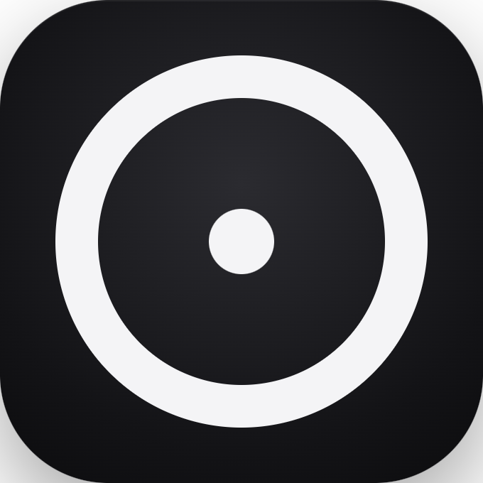

<p align="center">
  
</p>

<h1 align="center">Cyclone</h1>

<p align="center">Play Vortex on your Android phone.</p>

---

Cyclone is an unofficial Android client for [Vortex](https://playvortex.io). There is no Android version of the game, so Cyclone runs the real Windows client on your phone: it translates x86 to ARM with Box64, runs the game through Wine, and maps Direct3D to your phone's GPU with DXVK/vkd3d-proton and the Turnip Vulkan driver. All of that is built on top of [MiceWine](https://github.com/KreitinnSoftware/MiceWine-Application), stripped down and tuned for Vortex.

You just log in on the site like you normally would, tap Play, and the game launches fullscreen with touch controls.

## Current Features
- Touch controls: tap to click, drag to move the camera, on-screen joystick for moving, jumping and shift lock
- A chat button
- A menu button
- Custom settings
- keybinds

## Requirements

- An ARM64 phone on Android 9 or newer
- A Snapdragon chip with an Adreno GPU is strongly recommended. Developed and tested on a Galaxy S23+ (Snapdragon 8 Gen 2 / Adreno 740)
- Around 5 GB of free storage

## Installing

1. Grab the latest `.apk` from the [Releases](../../releases) page
2. Open it. Android will ask you to allow installs from your browser or file manager, allow it
3. Open Cyclone and log into your account
4. Pick a game and hit Play
5. Ignore the file not found error when launching

The first launch takes a while: it downloads the runtime (about 400 MB) and the game itself, then starts. Every launch after that goes straight into the game. Keep the phone plugged in for long sessions, translation is heavy and the phone will get warm.

## Controls

| Input | Action |
|---|---|
| Tap | Left click |
| Drag | Rotate camera |
| Joystick | Move forward / back |
| Space | Jump |
| LShift | Shift lock |
| Chat | Opens chat |
| Menu | Leave the game |

## Building from source

You need JDK 17, the Android SDK and NDK 26.

```
git clone --recursive https://github.com/Arbuzyonak/Cyclone
cd Cyclone
./gradlew assembleDebug
```

The APK lands in `app/build/outputs/apk/debug/`.

## Credits

Cyclone stands on a lot of other people's work:

- [MiceWine](https://github.com/KreitinnSoftware/MiceWine-Application) - the Android Wine runtime this project is forked from (MIT)
- [Wine](https://www.winehq.org/), [Box64](https://github.com/ptitSeb/box64), [DXVK](https://github.com/doitsujin/dxvk), [vkd3d-proton](https://github.com/HansKristian-Work/vkd3d-proton) and [Mesa/Turnip](https://mesa3d.org/)
- Inspired by [Tempest](https://github.com/solomon-gleeson/tempest/blob/master/README.md)
## Disclaimer

This is a community project. It is not made, endorsed or supported by Vortex or its developers. You need your own account, and the game is downloaded from the official site through your own login, exactly like the Windows launcher does.
